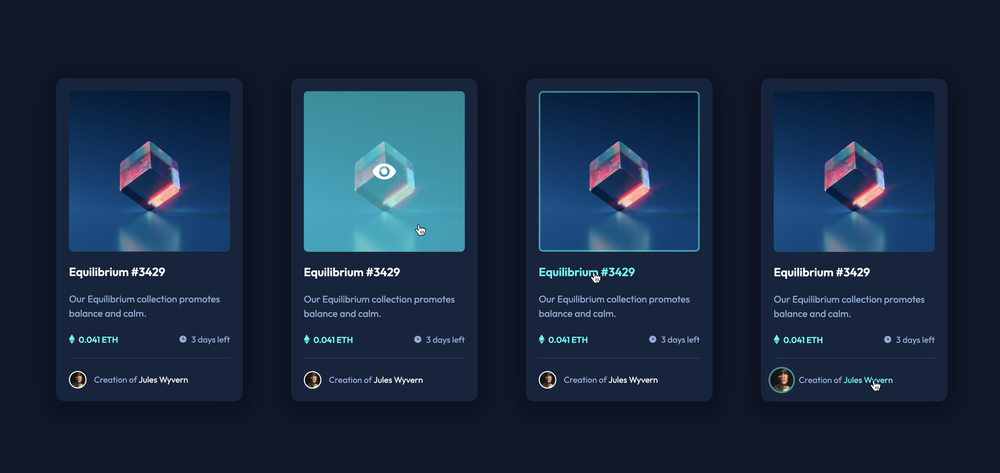

# Frontend Mentor - NFT preview card component solution

This is a solution to the [NFT preview card component challenge](https://www.frontendmentor.io/challenges/nft-preview-card-component-SbdUL_w0U) on Frontend Mentor


- [Frontend Mentor - NFT preview card component solution](#frontend-mentor---nft-preview-card-component-solution)
  - [Overview](#overview)
    - [The challenge](#the-challenge)
    - [Screenshot](#screenshot)
    - [Links](#links)
  - [My process](#my-process)
    - [Built with](#built-with)
    - [What I learned](#what-i-learned)
    - [Continued development](#continued-development)
    - [Useful resources](#useful-resources)
  - [Author](#author)

## Overview

### The challenge

Users should be able to:

- View the optimal layout depending on their device's screen size
- See hover states for interactive elements

### Screenshot



### Links

- Solution URL: [Files on Github](https://github.com/mindful108/frontendmentor-nft-preview-card.git)
- Live Site URL: [Interactive Solution on Github Pages](https://mindful108.github.io/frontendmentor-nft-preview-card)


## My process

### Built with

- Semantic HTML5 markup
- CSS with custom properties (variables)
- CSS animations
- Flexbox
- Mobile-first workflow
- Plain JavaScript

### What I learned

This was a beautiful yet simple design, so I decided to spend more of my time refining the hover states and adding animations. I tried to rely solely on CSS, but due to the structure of my HTML I had to use JavaScript when adding the outline to the image when hovering the NFT title (h1).

I primarily relied on my existing knowledge and experience with using ```::before``` and ```::after``` pseudo elements for adding the cyan overlay and eye icon when hovering the main image.

I probably could have made the hover animation for the artist's name work with pure CSS, but since I had already written the JavaScript for the title/image outline effect, it was easy just to add it there.

I could probably spend more time trying match the shadow for the card, but I think it sufficient based on the design photo (I don't have access to the Figma file.)

Altogether this was a fun and satisfying project that I did in just a few hours, most of the time spent on refining the interactions and animations.

### Continued development

I plan to do more Frontend Mentor projects to continue developing my speed and workflow using my own custom snippets and starter templates. I will also start to use Tailwind CSS and as I learn React I'll start using that for more interactive challenges.

### Useful resources

I used various web searches for implementing the various animations but have no specific resources to share for this particular project.

## Author

- Website | [Judah Lynn](https://judahlynn.com)
- Frontend Mentor | [@mindful108](https://www.frontendmentor.io/profile/mindful108)